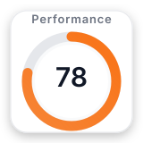
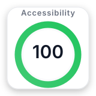
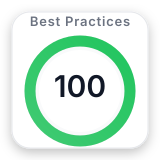

# 💫 About Me

💼 Web Developer with hands-on experience building and maintaining production web applications based on OpenCms.

🔭 Currently developing and maintaining web applications for the Italian Public Administration, focusing on accessibility, usability and content management systems.

🛠️ Experienced in OpenCms module development, frontend integration, CMS customization and editor-oriented solutions.

🌱 Continuously improving my skills in Java and modern frontend technologies while expanding my backend knowledge.

🤝 Open to collaborating on open source projects, CMS extensions and tools that improve developers' and editors' workflows.

💬 Ask me about OpenCms, JavaScript, Java, accessibility, frontend development and CMS customization.

🎯 Passionate about building maintainable, accessible and user-centered web applications.

---

# 🚀 Featured Projects

- 🏛️ **OpenCms Design Comuni Module** – Development and maintenance of modules for Italian Public Administration websites.
- ♿ **Accessibility-first components** – Building inclusive and user-friendly digital services.
- ⚙️ **CMS Customization** – Development of backend and frontend features for editors and end users.
- 🌐 **Workflow Automation** – Tools and integrations to simplify content management.

---

## 🌐 Socials

---

# 💻 Tech Stack

### Languages

### Frontend

### CMS

### Backend & Database

### Tools

---

# 📊 GitHub Stats

---

# 🔥 Lighthouse Overview

Accessibility and performance are an important part of my development workflow.

