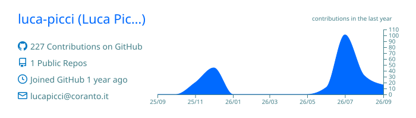
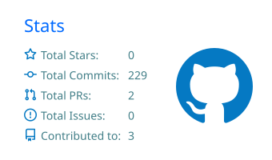
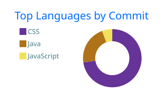

# Hi, I'm Luca Picci 👋

### Web Developer · OpenCms Specialist · Accessibility Advocate

I build accessible, maintainable and user-centered digital services, specializing in **OpenCms solutions for the Italian Public Administration**.

My work focuses on reusable frontend architecture, effective content-management workflows and interfaces designed for both end users and CMS editors.

---

## 👨‍💻 About Me

💼 Web Developer experienced in building and maintaining production applications based on **OpenCms**. 
🏛️ Currently working on digital services for the **Italian Public Administration**. 
♿ Focused on accessibility, usability and maintainable frontend architecture. 
🧩 Experienced in OpenCms module development, CMS customization and editor-oriented interfaces. 
⚙️ Interested in improving content-management workflows and building reusable frontend components. 
🌱 Expanding my knowledge of Java, backend development and modern frontend technologies. 
🤝 Open to collaborating on OpenCms modules, CMS extensions and workflow-improvement tools.

---

## 🚀 Featured Project

### [OpenCms Design Comuni Module](https://github.com/coranto-informatica/design-comuni-opencms-module)

A collection of OpenCms themes and modules for Italian municipality websites, developed around the needs of public digital services, content editors and citizens.

**My main areas of contribution include:**

* OpenCms module development and maintenance
* Frontend integration and reusable component development
* Accessibility and usability improvements
* CMS configuration and customization
* Editor-oriented features and interfaces
* Content-management workflow optimization

---

## 🛠️ Tech Stack

### Languages

### Frontend

### CMS

### Backend and Databases

### Tools

---

## 📊 GitHub Activity

Most of my professional development takes place within private repositories and organization-owned projects. The cards below provide an aggregate overview of my GitHub activity and the technologies I work with.

  

  
  

  
    Private contributions are included only as aggregate statistics. Repository names, source code and other private information are not exposed.
  

---

## 🔥 Lighthouse Overview

Accessibility, performance and code quality are integral parts of my development workflow.

  
  
  
  

  
    Scores are generated automatically from Lighthouse audits and updated through GitHub Actions.
  

---

## 🤝 Let's Connect

I'm interested in collaborating on:

* OpenCms modules and extensions
* Accessible public digital services
* CMS editor-experience improvements
* Reusable frontend components
* Content workflows and development automation

[Connect with me on LinkedIn →](https://www.linkedin.com/in/luca-picci/)
